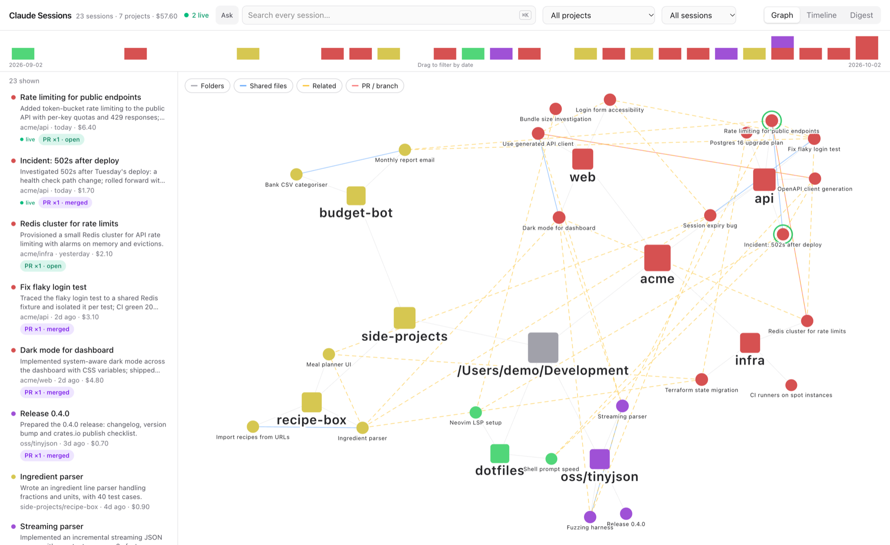

# claude-sessions



A local tool for browsing, searching and asking questions of every Claude Code session on your machine (`~/.claude/projects`), across all projects. It has two parts:
- a web app
- an MCP server, so any Claude Code session can query your history itself

## Quick start

```sh
cd web && npm install && npm run build && cd ..   # first time, or after UI changes
uv run sessions.py                                # http://127.0.0.1:8765
```

Flags:
- `--port 8765`
- `--no-llm` (e.g. `uv run sessions.py --no-llm`): turns off summaries, digest and ask, so the app makes no `claude -p` calls

Requirements:
- **Required:** [uv](https://docs.astral.sh/uv/) (it installs Python 3.12+ if needed; there are no Python dependencies) and Node 20+ (for building the UI).
- **Optional:**
  - `gh` (logged in) for PR status
  - iTerm for "Open in iTerm"
  - the `claude` CLI (logged in) for the AI features

## Web app

### Finding sessions
- **Search:** full text across every session, with matching snippets. ⌘K jumps to the search box.
- **Filters:**
  - project
  - PR state: has PR / open / merged / not merged
  - date range: drag across the activity strip
  - file: click any edited file to see every session that touched it
- **Ask your history:** ask a question in plain English ("how did I fix the flaky login test?"). The answer is grounded in your sessions and has clickable citations.

### Views
- **Graph**
  - your folder tree (`~` → `Development` → `acme` → repo), with sessions attached to the folder they ran in
  - long single-child paths collapse into one node (`envs/…/global`)
  - edges you can turn on and off: shared files, same PR/branch, related content
  - clicking a session highlights what it's connected to
- **Timeline:** one lane per project, with sessions as bars over time. Scroll to zoom, drag to pan, double-click to reset.
- **Digest:** one week (Monday to Sunday) grouped by top-level folder, with summaries, PR badges and cost. "Write digest" produces copyable markdown for standups and weekly updates.
- **Activity strip:** sessions per day, coloured by project.

### Session details
- **Overview:** AI summary, folder, branches, dates, cost and lines changed.
- **PRs:** badges coloured by live GitHub status (open / merged / closed).
- **Files and related sessions:** edited files are keyed `repo:path`, so a worktree and its main checkout match. Related sessions are found by content similarity.
- **Resume:** a copyable `cd … && claude --resume <id>` command, plus **Open in iTerm**.
- **Transcript:**
  - assistant replies rendered as markdown, tool calls collapsed
  - subagents in their own sections
  - very long sessions and messages are truncated, with a "show all" option
  - updates as a live session runs

### Live updates
- New and changing sessions appear within about 3 seconds.
- Sessions active in the last 2 minutes show a live badge in the list, a halo in the graph and a pulsing bar in the timeline.

### AI features
These use headless `claude -p` with your existing Claude login; no API key is needed.
- **Summaries:** a 1–2 sentence Haiku summary of every idle session. They're generated in the background and cached in `~/.cache/claude-sessions/summaries.json`, and only changed sessions are re-summarised. The first full pass costs roughly $0.35 for about 100 sessions.
- **Digest:** Haiku. **Ask:** Sonnet.
- **Safety:** every call runs with:
  - `--tools ""`, `--strict-mcp-config` and `--setting-sources ""`: no built-in tools, no MCP servers, no settings or hooks
  - `--no-session-persistence`
  - transcript text fenced as untrusted data

## MCP server

`mcp_server.py` is a read-only stdio server. It makes no paid calls and doesn't need the web app running.

```sh
claude mcp add --scope user claude-sessions -- uv run --quiet --directory "$PWD" mcp_server.py
claude mcp get claude-sessions    # should show ✔ Connected
```

| Tool | What it returns |
|---|---|
| `search_sessions(query, limit=10)` | Best-matching sessions, with summaries and snippets |
| `get_session(id, max_chars=20000)` | Metadata, summary, files, related sessions, resume command and transcript text |
| `sessions_for_file(path)` | Every session that edited a file (absolute path or `repo:path`) |
| `recent_sessions(days=7, project?)` | Recent activity, optionally for one project and its subfolders |
| `session_digest(week_offset=0)` | One week's sessions grouped by top-level folder |

Summaries come from the web app's cache, so run `sessions.py` at least once to fill it. The server supports both the 2026-07-28 MCP protocol and older clients.

## How it works

- **`sessions.py`** (Python stdlib only):
  - indexes the session JSONL files, cached by modification time
  - TF-IDF for related sessions and Ask retrieval
  - looks up PR status with `gh` in the background, cached for 10 minutes
  - runs the summary worker
  - serves the JSON API and the built UI
- **`web/`:** React, Vite, Tailwind, `react-force-graph-2d` and `react-markdown`.
- **`mcp_server.py`:** reuses `sessions.py`, speaking newline-delimited JSON-RPC over stdio.

### Security
- The server listens on 127.0.0.1 only and rejects foreign `Host` headers (protection against DNS rebinding).
- POST endpoints (resume, ask, digest) require a same-origin `Origin` header.
- `gh`, `osascript` and `claude` always get fixed argument lists and timeouts. PR URLs are validated before they reach `gh`.
- The iTerm command is shell-quoted, then escaped for AppleScript.
- Markdown never loads images. Links open in a new tab.

## Configuration

These environment variables point the app (and the MCP server) at a different history, which is useful for demos and tests:

| Variable | Default |
|---|---|
| `CLAUDE_SESSIONS_ROOT` | `~/.claude/projects` |
| `CLAUDE_SESSIONS_DEV` | `~/Development` (project names are relative to this) |
| `CLAUDE_SESSIONS_CACHE` | `~/.cache/claude-sessions/summaries.json` |

The screenshot above uses generated demo data.

## Development

```sh
uv run sessions.py                  # API on :8765
cd web && npm run dev               # UI with hot reload; Vite proxies /api
```

Tests (fake `gh`, `osascript` and `claude` programs on `PATH`, so nothing real gets called):

```sh
uv run test_sessions.py             # server, parser, PR status, iTerm, summaries, ask/digest, MCP
cd web && npm test                  # graph/timeline/filter logic, markdown safety
```

## Known limits

- Search and related sessions are linear TF-IDF scans. They're fine for hundreds of sessions; switch to SQLite FTS if it gets slow.
- Only Claude Code's default worktree location (`.claude/worktrees/<n>`) is recognised once a worktree has been deleted.
- PR status refreshes only when sessions change, or after the 10-minute cache expires.

## License

MIT. See [LICENSE](LICENSE).
